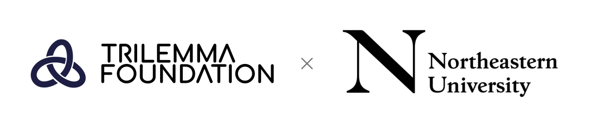

<!-- The banner has a permanent white background so both original logos remain readable in light and dark themes. -->

  

<!-- Season overview: replace this image in place to update the timeline and “You Are Here” map. -->

Datathon Season 2026 is a tournament for building microproducts: data-driven products that addresses a specific need. Co-hosted by Trilemma Foundation and Northeastern University, the season brings together a series of events, and build sessions leading up to Demo Day.

This repository is your central participant handbook. The tournament website provides a concise, visual overview; this handbook provides the deeper context. Luma is authoritative for individual event registration, times, locations, and event updates.

## What should I do right now?

1. **Apply for the Datathon if you haven’t already.** **Applications close October 4, 2026.** Complete the **[application form](https://airtable.com/appZZI7zTz3xYJE0r/pagyHcGcNVQmgCtAV/form)** before the deadline.

2. **Star this repository.** Keep it handy and check back as we upload more context, resources, and details about the build sessions and the rest of the season.

3. **Register and secure your spot in the build sessions.** As a Datathon participant, you must participate in **at least one build session**, and we encourage you to join all of them. Capacity is limited, so sign up early to secure your spot. See each session’s Luma page for registration and current details.
